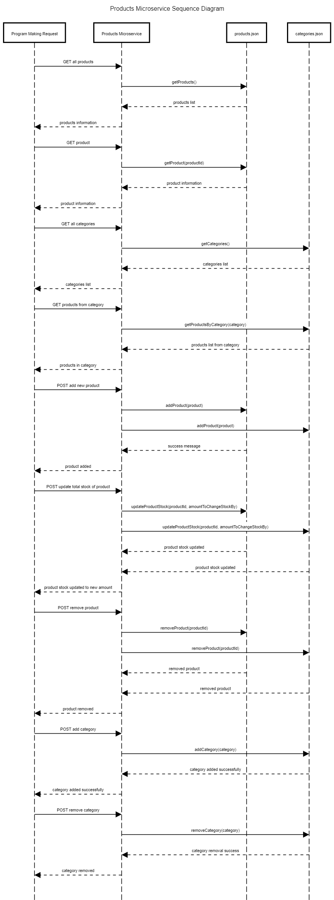

# Products Microservice Readme

## 1. Programmatically REQUEST Data

To programmatically request data from the Products Microservice, you can use HTTP requests. The microservice exposes several endpoints for different operations. Here's an example using `curl` for simplicity:

### Get Product Information

Make a GET request to retrieve information about a specific product:

```bash
curl -X GET http://localhost:8080/api/products/product?id=<productId>
```

Replace `<productId>` with the actual product ID you want information about.

## 2. Programmatically RECEIVE Data

To programmatically receive data from the Products Microservice, you need to handle the HTTP responses returned by the microservice. The microservice communicates using JSON.

### Example in JavaScript (Node.js)

Here's an example using Node.js and the `axios` library to make an HTTP request and handle the response:

```javascript
const axios = require("axios");

const getProductInformation = async (productId) => {
  try {
    const response = await axios.get(
      `http://localhost:8080/api/products/product?id=${productId}`
    );
    const productData = response.data;

    // Handle the product data as needed
    console.log("Product Information:", productData);
  } catch (error) {
    console.error("Error fetching product information:", error.message);
  }
};

// Example call
getProductInformation("1234");
```

Adjust the URL and data handling logic based on your specific requirements.

Remember to install the `axios` library using:

```bash
npm install axios
```

Feel free to adapt the examples based on your programming language and environment. Ensure that your application can handle HTTP requests and process JSON responses appropriately.

## 3. UML Sequence Diagram


